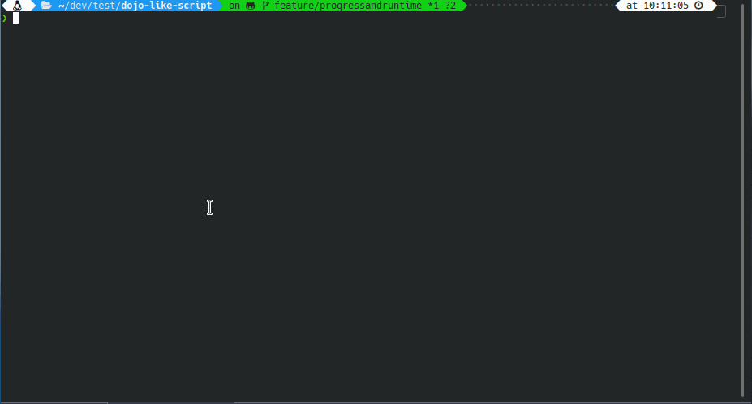

# dojo-like-script

A script to like all repo from a user or an organisation, or follow all users
from an organisation on GitHub.


## Requirements

  * [Bash](https://www.gnu.org/software/bash/) > 4.2
  * [Grep](https://www.gnu.org/software/grep/) with perl regexp (PCRE)
  * [jq](https://stedolan.github.io/jq/)
  * The fancy stuff (links, blink) need some specific terminal. See [Hyperlinks in terminal emulators](https://gist.github.com/egmontkob/eb114294efbcd5adb1944c9f3cb5feda).


## Usage

  1. Generate an [access token](https://github.com/settings/tokens)
     * Scope: **repo**
     * Scope: **user** 
  1. Export the GHTOKEN env var (`export GHTOKEN=yourGitHubAccessToken`)
  1. Run the script with `./run.sh` (the default org is [epfl-dojo](https://github.com/epfl-dojo))


## GIF




## Script options
  - Display help: `./run.sh --help`
  - You can specify an user with:
     - `./run.sh --user=username`
     - `./run.sh -u=username`
  - You can specify an organisation with:
     - `./run.sh --organisation=orgname`
     - `./run.sh --organization=orgname`
     - `./run.sh --org=orgname`
     - `./run.sh -o=orgname`
  - You can specify organisation members to follow with:
     - `./run.sh --follow-users-from-org=orgname`
     - `./run.sh -fufo=orgname`


## Links
  * Generate an [access token](https://github.com/settings/tokens)
  * [Star a repository](https://developer.github.com/v3/activity/starring/#star-a-repository-for-the-authenticated-user)


## Support

If you like this script, you can show your support by using it with the
following usernames/orgs ([contributors](https://github.com/epfl-dojo/dojo-like-script/graphs/contributors)):

```
curl -s https://raw.githubusercontent.com/epfl-dojo/dojo-like-script/master/run.sh | bash -s -- --org=epfl-dojo
curl -s https://raw.githubusercontent.com/epfl-dojo/dojo-like-script/master/run.sh | bash -s -- --username=loichu
curl -s https://raw.githubusercontent.com/epfl-dojo/dojo-like-script/master/run.sh | bash -s -- --username=ponsfrilus
curl -s https://raw.githubusercontent.com/epfl-dojo/dojo-like-script/master/run.sh | bash -s -- --username=richmartins
curl -s https://raw.githubusercontent.com/epfl-dojo/dojo-like-script/master/run.sh | bash -s -- --username=Roccom14
curl -s https://raw.githubusercontent.com/epfl-dojo/dojo-like-script/master/run.sh | bash -s -- --username=SaphireVert
curl -s https://raw.githubusercontent.com/epfl-dojo/dojo-like-script/master/run.sh | bash -s -- --username=jaavlex
curl -s https://raw.githubusercontent.com/epfl-dojo/dojo-like-script/master/run.sh | bash -s -- --username=zuzu59
```
